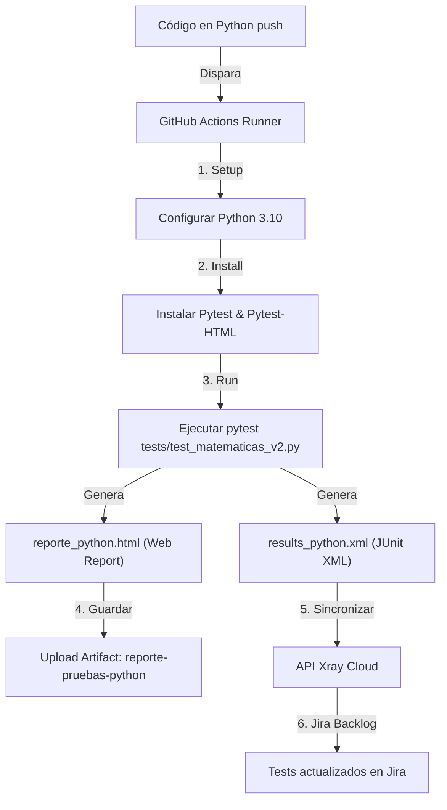

# 🐍 Guía de Automatización de QA en Python

Esta documentación está diseñada exclusivamente para proyectos de testing automatizado basados en **Python**. En esta guía se detalla el funcionamiento de la suite de pruebas unitarias y su integración con **GitHub Actions** y **Jira Xray**.

---

## 🗺️ Flujo de Trabajo del Pipeline de Python

El siguiente diagrama ilustra cómo funciona la integración continua del proyecto en Python:



---

## 📁 Archivos del Proyecto

El repositorio está estructurado únicamente con los siguientes archivos esenciales de Python:

| Ruta del Archivo | Propósito | Estado |
| :--- | :--- | :--- |
| **`tests/test_matematicas_v2.py`** | Suite de pruebas unitarias matemáticas vinculada a Jira Xray usando códigos de Jira (ej: `SCRUM_8`). | Activo |
| **`.github/workflows/run-tests-python.yml`** | Configuración activa del pipeline en la nube de GitHub para ejecutar las pruebas Python. | Activo |

---

## ⚙️ Regla de Oro para el Mapeo de Claves en Python

> [!WARNING]
> En Python, los nombres de funciones y métodos **no pueden contener guiones medios (`-`)** porque el lenguaje los interpreta como operadores de resta.
> 
> **La Solución en Xray:** Se utiliza el guion bajo (`_`). La integración de Xray convierte automáticamente el guion bajo en guion medio al procesar los resultados (ej: `SCRUM_8` se vincula a la tarea `SCRUM-8` en Jira).

* **Ejemplo en código (`tests/test_matematicas_v2.py`):**
  ```python
  def test_SCRUM_8_deberia_sumar_correctamente(self):
      self.assertEqual(sumar(10, 5), 15)
  ```

---

## 💻 Ejecución de Pruebas en forma Local

Para correr las pruebas localmente en tu máquina y generar los reportes de diagnóstico, ejecutá:

1. **Instalar dependencias de pruebas:**
   ```bash
   pip install pytest pytest-html
   ```

2. **Ejecutar la suite de pruebas:**
   ```bash
   pytest tests/test_matematicas_v2.py --junitxml=results_python.xml --html=reporte_python.html --self-contained-html
   ```

* *`results_python.xml`*: Reporte JUnit utilizado para sincronizar con Jira Xray.
* *`reporte_python.html`*: Reporte visual interactivo para analizar errores localmente en el navegador.

---

## 🚀 Despliegue en GitHub

Para subir tus pruebas actualizadas de Python y disparar el pipeline automático, ejecutá:

```bash
# 1. Agregar los archivos del proyecto
git add tests/test_matematicas_v2.py
git add .github/workflows/run-tests-python.yml
git add Jira_Git/README_python.md

# 2. Confirmar los cambios
git commit -m "feat: implementar suite de tests python v2 y reportes HTML"

# 3. Subir al repositorio
git push origin main
```

---

## 📤 Descarga de Reportes de Error en GitHub

Si una prueba falla (por ejemplo, el test diseñado para fallar a propósito `test_QA_8_deberia_fallar_a_proposito_para_verificar_reporte`):

1. Ve a la pestaña **Actions** en tu repositorio de GitHub.
2. Selecciona el workflow **`QA Automation - Python a Jira Xray`**.
3. Ingresa a la última ejecución (marcada con una cruz roja `❌`).
4. Ve a la sección inferior de **Artifacts** y descarga el archivo **`reporte-pruebas-python`** para ver el informe interactivo del error.
