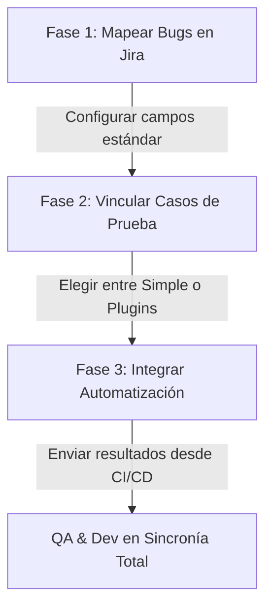

# 🔌 Guía de Integración de QA con Jira

Integrar tus procesos de testing con **Jira** es la mejor decisión para centralizar el desarrollo y el control de calidad en un solo lugar. En esta guía te explicamos **por dónde empezar**, las distintas opciones que tenés (gratuitas y profesionales) y cómo mapear el trabajo que ya estructuramos en esta carpeta hacia Jira.

---

## 🗺️ ¿Por dónde empezar? (El Camino de Integración)

Para no abrumarte, te recomendamos seguir esta hoja de ruta de menor a mayor complejidad:



---

## 📌 Fase 1: Mapeo de Bugs (Reporte de Errores)
Esta es la integración más fácil y de impacto inmediato. Jira tiene el tipo de incidencia (Issue Type) llamado **Error (Bug)** nativo.

Para empezar, configurá el formulario de creación de Bugs en tu proyecto de Jira utilizando los mismos campos que diseñamos en nuestra plantilla **[reporte_error.md](../QA/plantillas/reporte_error.md)**:

| Campo en nuestra plantilla | Campo equivalente en Jira | Recomendación de configuración |
| :--- | :--- | :--- |
| **Título del Bug** | **Summary (Resumen)** | Título conciso, ej: `BUG-001: Error 500 al guardar perfil` |
| **Descripción + Esperado vs Real** | **Description (Descripción)** | Pegá el cuerpo de la plantilla. Jira Cloud soporta Markdown. |
| **Entorno de Pruebas** | **Environment (Entorno)** | Activá este campo nativo de Jira para poner OS, navegador y build. |
| **Gravedad / Prioridad** | **Priority (Prioridad)** | Mapealo con las prioridades de Jira (Highest, High, Medium, Low). |
| **Versión / Build** | **Affects Version/s** | Configurá las versiones del software en la sección "Releases" de Jira. |
| **Módulo / Componente** | **Components (Componentes)** | Creá componentes en Jira como `Frontend`, `Backend`, `Database`. |

---

## 📌 Fase 2: Gestión de Casos de Prueba (Test Cases) en Jira
Jira por defecto no maneja "Casos de Prueba" de forma nativa. Para resolver esto, tenés dos opciones principales:

### Opción A: Enfoque "Ligero" (Sin Plugins - Gratis)
Si estás empezando y no querés gastar en licencias extras:
1. **Creá un tipo de tarea personalizado** en tu proyecto de Jira llamado `Caso de Prueba` (o `Test Case`) con un icono de check verde 🟢.
2. En la descripción de esta tarea, pegá la estructura de nuestra plantilla **[caso_prueba.md](../QA/plantillas/caso_prueba.md)**.
3. **Vinculación**: Usá la función nativa de Jira **"Link Issue"** para relacionar el `Caso de Prueba` con la `Historia de Usuario (User Story)` correspondiente usando la relación *"is tested by"* (es probado por).
4. Cuando encuentres un bug al ejecutar la prueba, creá el Bug y vinculalo al Caso de Prueba usando *"blocks"* o *"relates to"*.

### Opción B: Enfoque Profesional (Con Plugins - Estándar de la Industria)
Si buscás un control de calidad riguroso y automatizado, debés instalar una app desde el *Atlassian Marketplace* de Jira. Las dos líderes del mercado son:

* **Xray Test Management (Muy recomendado)**:
  * Convierte los casos de prueba en tipos de incidencias nativos de Jira (`Test`, `Test Set`, `Test Execution`).
  * Te permite organizar carpetas de pruebas, planificar ejecuciones por versión y ver gráficos de cobertura directamente en tus Historias de Usuario.
* **Zephyr Squad**:
  * Muy popular, con una interfaz intuitiva para crear ciclos de prueba rápidos y ejecutar pasos directamente haciendo clic en botones de *Pass/Fail* integrados en la pantalla de Jira.

---

## 📌 Fase 3: Integración de Pruebas Automatizadas (CI/CD ➡️ Jira)
Si en el futuro implementás pruebas automáticas con herramientas como **Playwright**, **Cypress** o **Jest**, podés hacer que cada vez que se ejecuten en tu servidor (GitHub Actions, GitLab CI, etc.), los resultados se suban **automáticamente** a Jira.

### ¿Cómo funciona técnicamente?
1. Configuras tu framework de automatización para generar reportes en formato **JUnit XML** (es un estándar que casi todas las herramientas soportan).
2. En tu pipeline (ej. GitHub Actions), agregás un paso que consuma la **API REST** de tu plugin de Jira (ej: Xray API) y le envíe ese archivo XML.
3. Jira leerá el archivo, creará los casos de prueba si no existen y marcará las ejecuciones como *Passed* o *Failed* de forma 100% automática, asociándolas a la release actual.

## 🆓 ¿Cómo usar Jira de forma 100% Gratuita?

¡Sí, totalmente! **Jira Cloud ofrece un plan 100% gratuito** que es perfecto para empezar, aprender y gestionar proyectos personales o de equipos pequeños. No requiere tarjeta de crédito para registrarse.

### 🌟 Beneficios del Plan Gratuito de Jira:
* **Hasta 10 usuarios** sin pagar un centavo.
* **Tableros Scrum y Kanban** ilimitados.
* **Capacidad de crear campos y tipos de tareas personalizados** (ideal para nuestro tipo de tarea `Caso de Prueba`).
* **Automatización básica** (ej. "cuando se cierre un bug, avisar por mail").
* **2 GB de almacenamiento** para adjuntar capturas de pantalla, videos y logs de error.

---

## 🛠️ Cómo configurar tu Jira Gratis para QA (Paso a Paso)

Para empezar hoy mismo de forma gratuita y sin complicaciones:

1. **Creá tu cuenta**: Ve a [Atlassian Jira Free](https://www.atlassian.com/es/software/jira) y regístrate con tu cuenta de Google o correo electrónico. Elegí un subdominio para tu espacio (ej. `mi-proyecto.atlassian.net`).
2. **Creá tu primer proyecto**:
   * Elegí la plantilla **Desarrollo de Software (Software Development)**.
   * Seleccioná **Kanban** o **Scrum** (Kanban es más sencillo para empezar).
   * Seleccioná un tipo de proyecto **Gestionado por el equipo (Team-managed)**, ya que es el más fácil de configurar y personalizar.
3. **Creá el tipo de tarea "Caso de Prueba" (Gratis)**:
   * Ve a **Configuración del proyecto** ⚙️ > **Tipos de incidencia (Issue Types)**.
   * Haz clic en **Añadir tipo de incidencia** y escribe `Caso de Prueba`.
   * Configura sus campos. Puedes agregar un campo de texto largo llamado "Pasos de Ejecución" y otro llamado "Resultado Esperado", o simplemente usar el campo *Descripción* estándar y pegar nuestra plantilla **[caso_prueba.md](../QA/plantillas/caso_prueba.md)**.
4. **¡Listo para testear!**: ya podés crear tus Historias de Usuario, tus Casos de Prueba, vincularlos entre sí y registrar los Bugs cuando algo falle, todo sin gastar un solo dólar.

## 🤖 Integración de GitHub Actions + Jira Xray (100% Gratis)

¡Sí, absolutamente! **GitHub es 100% gratuito** para alojar repositorios (tanto públicos como privados) y te da acceso sin costo a **GitHub Actions**, su potente motor de automatización y CI/CD (Integración Continua).

### 🎁 El Plan Gratis de GitHub te ofrece:
* **Repositorios privados y públicos ilimitados** para subir tus scripts de prueba automáticos.
* **2,000 minutos mensuales gratis** de GitHub Actions para repositorios privados (suficiente para ejecutar cientos de pruebas al mes).
* **Minutos ilimitados y gratuitos** si tu repositorio es público (Open Source).
* **GitHub Secrets**: Un espacio seguro para guardar tus claves de acceso de la API de Jira Xray sin exponerlas en tu código.

---

## 🔗 ¿Cómo se conectan GitHub y Jira Xray de forma automática?

El flujo técnico funciona de la siguiente manera:

```text
[ Script de Pruebas en GitHub ] ➡️ [ Ejecución en GitHub Actions ] ➡️ [ Generación de junit.xml ] ➡️ [ Envío por API a Xray ] ➡️ [ Resultados en Jira ]
```

### 1. Preparar las credenciales en Jira (Xray API keys)

Las API Keys de Xray no se configuran desde la sección del proyecto, sino a nivel **Global de Jira (Administración)**. Sigue estos pasos para encontrarlas:

1. Hacé clic en el **icono de engranaje `⚙️` (Configuración de Jira)** en la barra superior derecha de la pantalla.
2. En el menú desplegable que se abre, selecciona **Aplicaciones (Apps)**.
3. En la barra lateral izquierda que aparecerá en esta nueva pantalla de administración, desplázate hacia abajo hasta la sección que dice **XRAY** o **Xray Cloud**.
4. Allí verás la opción **API Keys** (o **Client Credentials** / **Credenciales de cliente**). Hacé clic en ella.
5. Hacé clic en el botón azul **Crear Clave de API** (arriba a la derecha).
6. En la ventana emergente, verás un campo llamado **Usuario**. Empezá a escribir tu propio nombre, apellido o correo electrónico con el que estás registrado en Jira.
7. Seleccioná tu usuario cuando aparezca en la lista desplegable (esto le dice a Jira qué persona figurará como la ejecutora de las pruebas automatizadas que suba GitHub).
8. Hacé clic en el botón **Generar** que ahora se habrá activado.
9. Copiá y guardá los dos valores en un lugar seguro:
   * **Client ID** (ID de cliente)
   * **Client Secret** (Clave secreta de cliente)
10. En tu repositorio de GitHub, ve a **Settings** > **Secrets and variables** > **Actions** y añade dos secretos:
    * `XRAY_CLIENT_ID`
    * `XRAY_CLIENT_SECRET`

### 2. Plantillas de GitHub Actions (Workflows YAML)
Los flujos de ejecución en la nube de GitHub se encuentran en la carpeta `.github/workflows/` en la raíz de tu proyecto para que GitHub los pueda ejecutar automáticamente. Hemos creado dos versiones independientes:

#### A. Pipeline de JavaScript
* Archivo activo: `.github/workflows/run-tests.yml`
* Ejecuta pruebas unitarias de Jest (`suma.test.js` y `suma_v2.test.js`) y sube el reporte `results.xml` a Xray.

#### B. Pipeline de Python
* Archivo activo: `.github/workflows/run-tests-python.yml`
* Ejecuta pruebas de unittest (`test_matematicas.py`) usando pytest y sube el reporte `results_python.xml` a Xray.

---

## 🔍 Solución: "No me aparece la vista o Tablero de Testing en Jira"

Es completamente normal. **Jira por defecto no trae una pestaña llamada "Testing" o "Tablero de Testing" activada.** Aquí tenés cómo solucionarlo paso a paso:

---

### Caso A: Querés que tu tablero principal tenga una columna de "Testing" o "QA"
Por defecto, Jira solo crea las columnas *Por Hacer (To Do)*, *En Progreso (In Progress)* y *Listo (Done)*.

**Cómo agregar la columna "Testing":**
1. Si usás un proyecto **Gestionado por el equipo (Team-managed)**:
   * Ve a tu Tablero (Board).
   * Al final de las columnas a la derecha, hacé clic en el botón con el signo **`+`** (Añadir columna).
   * Escribí `Testing` (o `QA`) y presiona Enter.
   * ¡Listo! Ahora podés arrastrar tus Historias de Usuario y Tareas a esa columna cuando estén listas para ser probadas.
2. Si usás un proyecto **Gestionado por la empresa (Company-managed)**:
   * Hacé clic en los tres puntos **`...`** arriba a la derecha de tu tablero > **Configuración del tablero (Board settings)**.
   * Ve a la sección **Columnas (Columns)** en el menú lateral.
   * Hacé clic en **Añadir columna (Add column)**, llámala `Testing`.
   * Arrastrá el estado `Testing` o `En pruebas` desde la columna "Estados sin asignar" hacia tu nueva columna.

---

### Caso B: Instalaste Xray o Zephyr, pero no ves la pestaña en el menú lateral
Si estás usando un proyecto **Gestionado por el equipo (Team-managed)**, Jira oculta por defecto las aplicaciones externas hasta que las habilitás en la configuración del proyecto.

**Cómo activar la pestaña de Testing (Apps):**
1. Entrá a tu proyecto y ve a **Configuración del proyecto (Project settings)** ⚙️ abajo a la izquierda.
2. Hacé clic en **Características (Features)**.
3. Buscá la opción de **Aplicaciones (Apps)** o el nombre de tu plugin (**Xray** / **Zephyr**) en la lista de interruptores.
4. **Activá el interruptor (Toggle)** para encenderlo.
5. Volvé al proyecto y verás que ahora aparece la sección en tu menú lateral izquierdo.

---

### Caso C: No has instalado el plugin de Testing en tu Jira
Si estás buscando las herramientas de testing avanzadas (el gestor de casos de prueba) y no ves ninguna opción, es porque primero debes "comprar" (gratis en su versión de prueba) la extensión desde el Marketplace de Jira.

**Cómo instalar la suite de Testing:**
1. En la barra superior de Jira, hacé clic en el menú **Aplicaciones (Apps)** > **Explorar más aplicaciones (Find new apps)**.
2. En el buscador escribí `Xray` o `Zephyr Squad`.
3. Selecciona la aplicación y haz clic en **Probar gratis (Try it free)** o **Obtener aplicación (Get app)**.
4. Jira la instalará en unos segundos y automáticamente habilitará el menú de Testing en tu barra lateral.

---

### Caso D: Querés crear un Tablero Kanban exclusivo para ver solo Bugs y Pruebas
Si preferís que los desarrolladores usen su tablero y vos como QA tener un tablero separado que solo muestre las tareas de testing:
1. En el menú lateral de Jira, hacé clic en el nombre de tu tablero actual (un desplegable con flecha hacia abajo).
2. Selecciona **Crear tablero (Create board)**.
3. Elegí **Tablero Kanban**.
4. Selecciona crear el tablero a partir de un **Proyecto existente**.
5. Nombralo `Tablero de Testing` y selecciona tu proyecto.
6. Una vez creado, podés ir a los tres puntos **`...`** > **Configuración del tablero** > **Filtro** y cambiar la consulta para que solo muestre: `project = TU_PROYECTO AND (issuetype = Bug OR issuetype = "Caso de Prueba")`.
